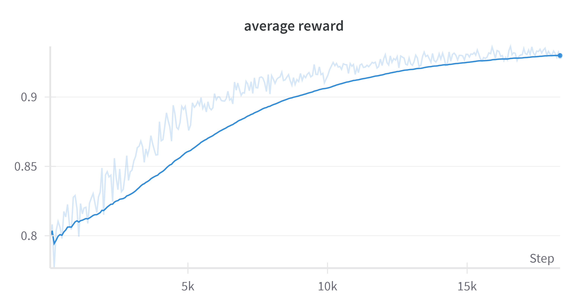
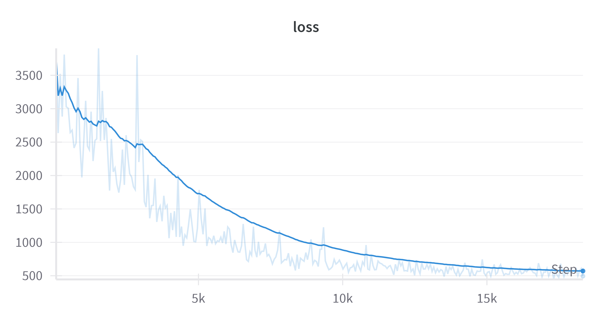

# Accurate and Diverse LLM Mathematical Reasoning via Automated PRM-Guided GFlowNets

This project implements the methodology described in our research paper:

**[Accurate and Diverse LLM Mathematical Reasoning via Automated PRM-Guided GFlowNets](https://arxiv.org/abs/2504.19981)**

## 1. Generate the training Dataset for the Process Reward Model (PRM)
### 1.1 Generating a Seed Dataset

The first step is to create a seed dataset containing questions, answers, and an indicator of whether the answer is correct. This can be done using the `seed.py` script with parameters for your model and the number of samples to generate.
```bash
python seed.py --model "your_model" --num_samples "number_of_samples"
```
### 1.2 Generating the Training Dataset with OmegaPRM

Once the seed dataset is created, you can generate the training dataset for the PRM using the `run_mcts.py` script. This script implements the OmegaPRM algorithm and requires the path of the model that will generate the rollouts and the seed dataset path.
```bash
python run_mcts.py --model "your_model" --dataset "your_seed_dataset"
```
### 1.3 Augmenting the Dataset

To further enhance the training dataset, you can use the `data_augmentation.py` script. This script leverages rollouts generated during the evaluation of steps to significantly increase the dataset size. You'll need to specify the input path, output path, and optionally a similarity threshold.
```bash
python data_augmentation.py --input_path "your_omegaPRM_dataset" --output_path "output_path_dataset.csv" --similarity_threshold 0.85
```
### 1.4 PRM Training Dataset
The final dataset will consist of three columns:  
- The first column contains the question and the beginning of the answer.  
- The second column contains the next step (a single step, not the entire continuation of the answer).  
- The third column corresponds to the evaluation of the step present in the second column.  

## 2. Training the PRM

### 2.1 Finetuning
Now that the dataset is ready, we can train our chosen LLM to become a PRM using the script available in the `/PRM_FineTuning` directory. To meet our requirement of evaluating steps with scores ranging between 0 and 1, we replace the default loss function used by the Transformers trainer (MSE Loss) with BCE Loss, which is better suited to our problem.
```bash
accelerate launch PRM_Finetuning.py --model "your_model" --dataset "your_dataset"
```

### 2.2 Testing with Guided Search

After training the PRM, we can evaluate its effectiveness using the script in the `/Guided Search` directory. This allows us to test whether our PRM successfully guides a base LLM to produce higher quality responses to mathematical questions.
```bash
accelerate launch Guided_Search.py --"your_model" --"your_PRM" --"temperature" --"top_p" --"number_of_proposed_steps" --"max_steps"
```
## 3. GFlowNets

### 3.1 GflowNets Finetuning
Finally, you can finetune your chosen LLM using the script provided in the `/GFlowNets` directory. GFlowNets trained models naturally sample diverse, high-quality solutions proportional to their rewards, as measured by the PRM.
```bash
accelerate launch main.py --"your_model" --"your_PRM" 
```
<p align="center">
  
  
</p>


If you use our work, please cite our paper:

```bibtex
@misc{younsi2025accuratediversellmmathematical,
      title={Accurate and Diverse LLM Mathematical Reasoning via Automated PRM-Guided GFlowNets}, 
      author={Adam Younsi and Abdalgader Abubaker and Mohamed El Amine Seddik and Hakim Hacid and Salem Lahlou},
      year={2025},
      eprint={2504.19981},
      archivePrefix={arXiv},
      primaryClass={cs.LG},
      url={https://arxiv.org/abs/2504.19981}, 
}

